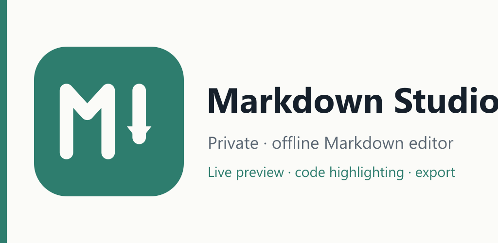
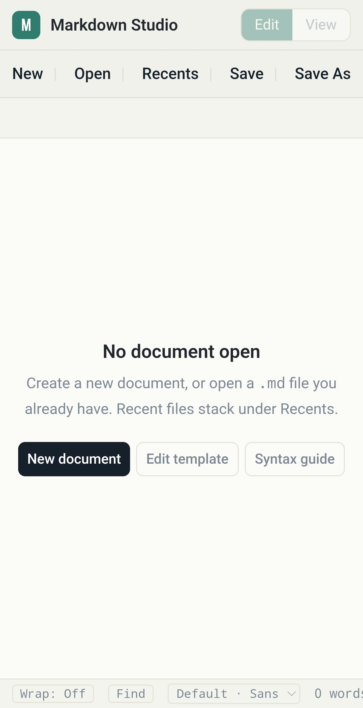
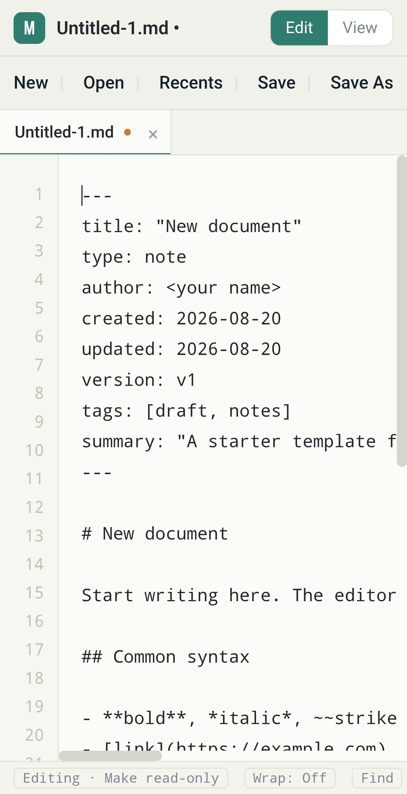
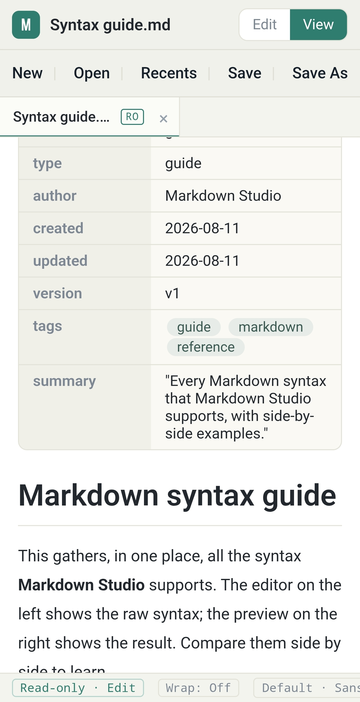
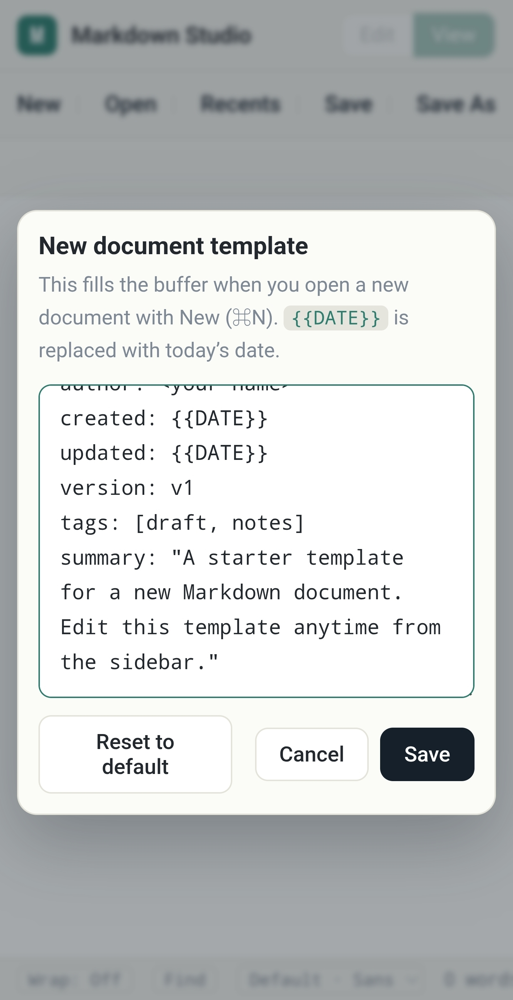

<div align="center">



# Markdown Studio

**A private, offline Markdown editor — live preview, syntax highlighting, and export.**

[](LICENSE)


-informational)


</div>

Markdown Studio is a fast, **dependency-free** Markdown editor packed into a single, self-contained HTML file — no build step, no frameworks, no external libraries. The Markdown parser, the syntax highlighter, and the DOCX/HTML exporters are all hand-written. The same code runs as a **web app**, an **Android app** (via Capacitor), and a **desktop app** (via Electron).

Everything you write stays on your device. There are no accounts, no analytics, and no trackers.

## Screenshots

<table>
  <tr>
    <td align="center" width="25%"><br><sub>Start screen</sub></td>
    <td align="center" width="25%"><br><sub>Editor + frontmatter</sub></td>
    <td align="center" width="25%"><br><sub>Live preview</sub></td>
    <td align="center" width="25%"><br><sub>New-doc template</sub></td>
  </tr>
</table>

## Features

- **Live preview** — side-by-side (desktop) or a tap-to-toggle Edit/View (mobile), rendered as you type.
- **Full Markdown** — headings, bold/italic/strikethrough, links, images, ordered/unordered/task lists, blockquotes (nested), tables, and horizontal rules.
- **Frontmatter card** — a leading `--- … ---` block is rendered as a tidy metadata card (array values become tag chips).
- **Code blocks with syntax highlighting** — Python, JavaScript, TypeScript, JSON, SQL, Bash, HTML, and CSS; pick the language per block and copy with one tap.
- **Multiple documents** — tabbed editing, a Recents list, and a read-only viewer mode.
- **Customizable new-document template** — with a `{{DATE}}` placeholder.
- **Export** — Markdown (`.md`), a self-contained HTML file, Word (`.docx`), or print / Save as PDF.
- **Open & share** — open `.md` / `.markdown` / `.txt` files, and (on Android) receive files shared from other apps.
- **Private by design** — 100% offline; nothing is uploaded to the developer.

## Platforms & running

There is **no build step for the web app** — the editor is one HTML file.

### Web / desktop preview

Open `markdown-studio.html` directly in a browser, or serve it locally (recommended, so File System Access and IndexedDB behave consistently):

```bash
python -m http.server 5173
# then open http://localhost:5173/markdown-studio.html
```

### Android (Capacitor)

The Android app wraps the editor with a thin native bridge (native file save / share). It ships **`markdown-studio-en.html`** (a fully-English build of the canonical).

```bash
cd android-app
npm install
npm run build:apk      # debug APK
npm run build:release  # signed APK + AAB (needs a keystore; see android-app/README.md)
```

Requires **JDK 17** and the Android SDK. Details, signing, and store-release notes are in [`android-app/README.md`](android-app/README.md).

### Desktop (Electron)

A desktop wrapper lives in [`desktop/`](desktop/) (portable build and an NSIS installer). See that folder for build scripts.

## Privacy

Markdown Studio collects **no data**. There are no accounts, analytics, ads, or trackers, and nothing is sent to the developer. The only network request is optional: when you export a document that references a remote image URL *you* added, the app fetches that image to embed it.

Full policy: **https://markdown-studio-privacy.vercel.app**

## Repository layout

```
markdown-studio.html          Canonical editor (Korean UI) — web / desktop
markdown-studio-en.html       Fully-English build shipped by the Android app
index.html                    Redirect stub → markdown-studio.html
android-app/                  Capacitor Android project + store assets
desktop/                      Electron desktop wrapper
_archive/                     Original single-pane editor (archived)
docs/                         Security review & maintenance docs
```

> **Note for contributors:** the hand-rolled Markdown parser is the **single source of truth** for both the live preview and the HTML/PDF/DOCX exporters — don't add a second parser. Shared editor logic must be kept in sync between `markdown-studio.html` and `markdown-studio-en.html`.

## License

[MIT](LICENSE) © 2026 dev-paransan
